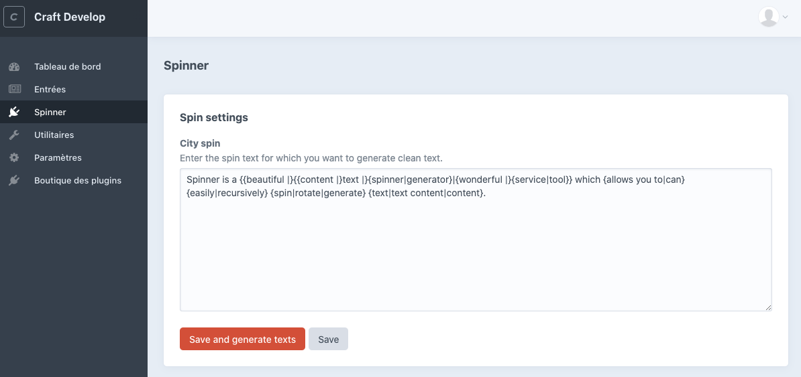
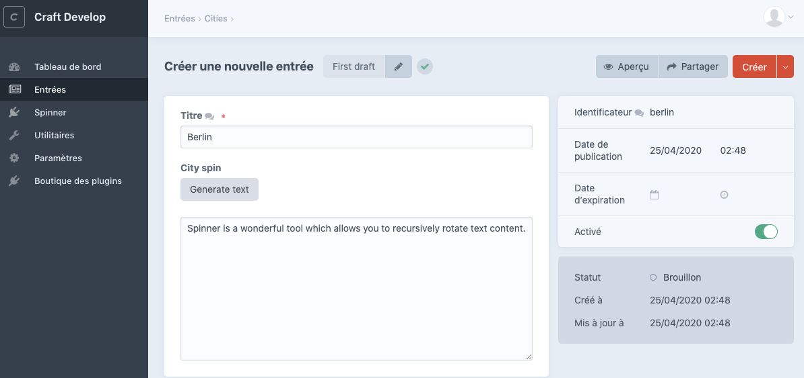

# Spinner plugin for Craft CMS 4.x
Spinner lets you do fast, easy and bulk content spinning.

## ⚠️ Disclaimer

Content spinning is a pratice that **is not recommended** in the SEO world. Use it with care and at your own risks.

## Requirements

This plugin requires Craft CMS 4.0.0 or later.

## Why Spinner is not on the Craft Plugin Store ?
This is my first Craft plugin and my first real PHP project. I'm more a front dev so the code is a little bit shitty but it works for my use case.
Plus, the plugin doesn't fully support multisite (translations).

If you want to review or complete my code in order to push it on the Craft Plugin Store, you are very welcome.

## Installation

To install the plugin, follow these instructions.

1. Add this repository to your composer.json :
        
        "repositories": [
            {
              "type": "git",
              "url": "https://github.com/LouisCuvelier/craft-spinner.git"
            }
        ]

2. Open your terminal and go to your Craft project :

        cd /path/to/project
       

3. Then tell Composer to load the plugin:

        composer require LouisCuvelier/spinner

4. In the Control Panel, go to Settings → Plugins and click the “Install” button for Spinner.

## Spinner Overview

1. Bulk generate texts based on a spin text defined in the control panel.
2. Generate one text on a new entry, based on the same spin text defined in the control panel.

## Using Spinner

1. Create a new field with a `Spin Text` type.
2. Go to the control panel section (at `yourwebsite.com/admin/spinner`) and write some spin text.
3. Save your text :
    1. **Save** → It will only save your spin text to the database.
    2. **Save and generate spin texts** → It will save your spin text and generate a text for each entry where the field exists.

### Example

#### Create a Spin Text
I created a `Spin Text` field. I went to the Spinner control panel and I wrote some spin text. Then, I clicked `Save and generate texts`.

#### Generate a text
If my entries already exist, I can bulk generate texts by using the button `Save and generate texts`.
But if my entry doesn't exist yet, I can create a new one and use the `Generate text` button.

#### Regenerate every texts on each entry
If I want to regenerate every texts on each entry, I can simply go to the control panel and click on the button `Save an generate texts` that correspond to the spin I want to regenerate from.

## License

[MIT License](LICENSE.md).

Brought to you by [Louis Cuvelier](https://www.louiscuvelier.com)